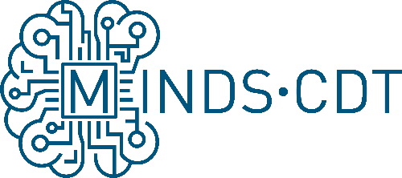
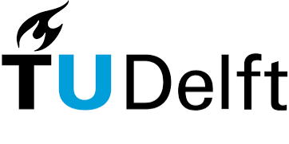
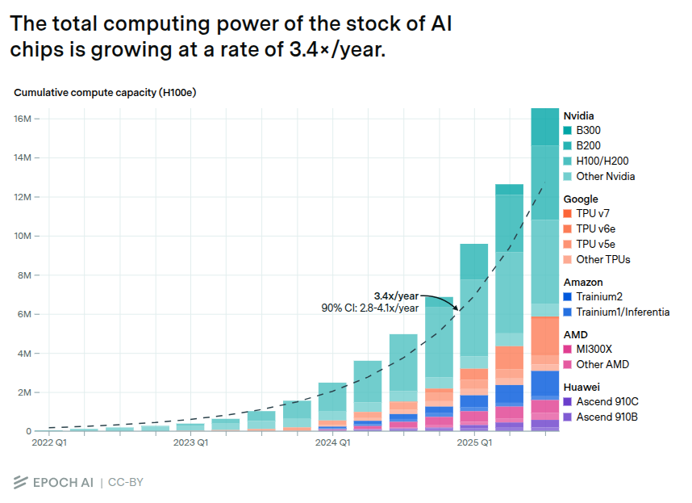

<!-- _class: title -->
<!-- _paginate: false -->

# SNNs to Silicon

### *Compiling FPGA Bitstreams from Spiking Neural Networks*

*ISCAS 2026 Tutorial*

**Michail Rontionov**<sup>1</sup>, Jens E. Pedersen<sup>2</sup>, Charlotte Frenkel<sup>3</sup>,
Francisco Ayala Le Brun<sup>3</sup>, Nassim Beladel<sup>4</sup>

<div class="title-logos">
  <div class="left-column">
    <div class="logo-row">
      <div class="logo-wrapper"><span class="sup">1</span></div>
    </div>
    <div class="logo-row">
      <div class="logo-wrapper"><span class="sup">1</span></div>
      <div class="logo-wrapper"><span class="sup">1</span></div>
    </div>
  </div>
  <div class="logo-sep" aria-hidden="true"></div>
  <div class="right-column">
    <div class="badge-row">
      <span class="sup">2</span>
      <span class="sup">3</span>
      <span class="sup">4</span>
    </div>
    <div class="logo-row">
      <div class="logo-wrapper"></div>
      <div class="logo-wrapper"></div>
      <div class="logo-wrapper"></div>
    </div>
  </div>
</div>

---

## Why this tutorial?

<div class="columns">
<div>



<p style="font-size: 0.65em; margin-top: 0.5em;">Source: Sevilla et al., "Compute Trends Across Three Eras of Machine Learning," Epoch AI, 2022. CC BY 4.0.</p>

</div>
<div>

- **Neuromorphic computing** with spiking neural networks (SNNs) offers lower latency and power for edge AI
- The ecosystem is **fragmented**: models are tied to specific simulators, toolchains, and hardware
- The **simulation-to-hardware gap** introduces subtle numerical divergences that are hard to localize

</div>
</div>

---
## Our approach

Use the **Neuromorphic Intermediate Representation** ([NIR](https://neuroir.org)) as a shared specification to go from trained SNNs to FPGA bitstreams -- with verification at every step.

```
P[Continuous] --Simulate--> P[Discrete] --Quantize--> P[Quantized] --Compile--> P[Hardware]
```

---

<!-- _class: organizers -->

## Organizers

<div class="columns">
<div>

**Michail Rontionov**
University of Southampton
Tutorial Lead

**Jens Egholm Pedersen**
Technical University of Denmark
NIR, SNNs in JAX

**Charlotte Frenkel**
Delft University of Technology
NC and design approaches

</div>
<div>

**Francisco Ayala Le Brun**
Independent Researcher
SpinalHDL

**Nassim Beladel**
ETH Zurich
ASICs and tutorial support

</div>
</div>

---

<!-- _class: agenda -->

## Agenda

| Time | Topic | Presenter(s) |
|------|-------|---------------|
| 08:30 | Welcome | Michail & Jens |
| 08:40 | NC introduction and design approaches | Charlotte |
| 09:00 | NC on FPGA & ASIC | Michail & Nassim |
| 09:20 | NIR and SNN training | Jens |
| 09:50 | Hands-on: SNNs | Jens & Michail |
| *10:10* | *Break* | |
| 10:30 | NIR2FPGA | Michail |
| 10:45 | SpinalHDL | Francisco |
| 11:00 | Hands-on: RTL & Simulation | Michail, Jens & Nassim |
| 11:55 | Goodbye | Michail & Jens |

---

<!-- _class: title -->

## NC Introduction and Design Approaches

**Charlotte Frenkel** -- Delft University of Technology

*08:40 - 09:00*

<!-- Covers:
- Neuromorphic computing: Algorithms and their advantages
- Neuromorphic Hardware: Design space
- The problem of Co-design
- Top-down approach
- Bottom-up approaches
-->

---

<!-- _class: title -->

## NC on FPGA & ASIC

**Michail Rontionov & Nassim Beladel**

*09:00 - 09:20*

<!--
1. Design space of digital neuromorophic hardware (7min)
2. FPGA Accelerators exhibiting various design features
   1. YANA
   2. Spiker+
   3. FENN (?)
3. ASIC Accelerators exhibiting various design features
-->

---

<!-- _class: title -->

## Neuromorphic Intermediate Representation (NIR)

**Jens E. Pedersen** -- Technical University of Denmark

*09:20 - 09:40*

<!--
"Compsci abstraction of the co-design idea"
-->

---

<!-- _class: title -->

## Building and training SNNs

**Jens E. Pedersen** -- Technical University of Denmark

*09:40 - 09:50*

<!--
Frameworks: Norse and Jaxsnn
Export graph and visualize with nirviz
-->

---

<!-- _class: title -->

## Hands-on: SNNs

**Jens E. Pedersen & Michail Rontionov**

*09:50 - 10:10*


[github.com/neuralfpga/26iscas](https://github.com/neuralfpga/26iscas)

<!--
Build and train neuron notebook.
-->

---

<!-- _class: title -->

## Break

*10:10 - 10:30*

---

<!-- _class: title -->

## NIR2FPGA

**Michail Rontionov** -- University of Southampton

*10:30 - 10:45*

<!--
1. Theoretical Approach (p -> p')
2. Example Scenario: MNIST Network
3. Generated design
   - NIR Graph -> Generated Accelerator Figure (for LIF not cubalif)
   - Simulation & Quantization
   - Hardware properties (dataflow, time-stepped, etc.)
   - Flow (Compilation -> Vivado -> Hardware PYNQ)
4. So how do we write the compiler?
-->
---

<!-- _class: title -->

## SpinalHDL

**Francisco Ayala Le Brun**


*10:45 - 11:00*

<!--
1. Why Spinal vs conventional?
2. Some side-by-side examples
3. How we're using it in NIR2FPGA (resolve method)
-->
---

<!-- _class: title -->

## Hands-on: RTL & Simulation

**Michail Rontionov, Jens E. Pedersen & Nassim Beladel**

*11:00 - 11:55*


[github.com/neuralfpga/26iscas](https://github.com/neuralfpga/26iscas)

---

## Summary & Thank you

**What we covered today:**

1. **Neuromorphic computing** -- co-design, FPGA & ASIC landscape
2. **NIR** -- a shared, platform-independent graph representation for SNNs
3. **SNNs in JAX** -- training and exporting spiking networks
4. **NIR2FPGA** -- from NIR graphs to streaming FPGA accelerators via SpinalHDL

**Key takeaway: NIR can drive both simulation and synthesis**

**Code:** [github.com/mrontio/nir2fpga](https://github.com/mrontio/nir2fpga/) -- **NIR:** [neuroir.org](https://neuroir.org)

**Contact:** Michail (*m.rontionov@soton.ac.uk*) and Jens (*jegpe@dtu.dk*)
